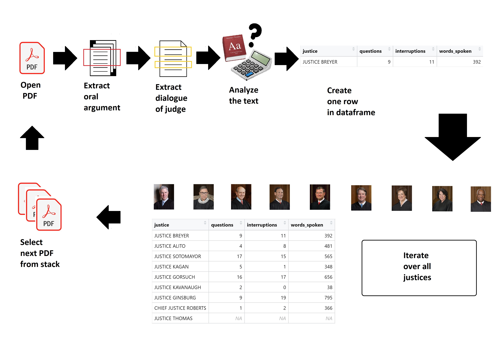
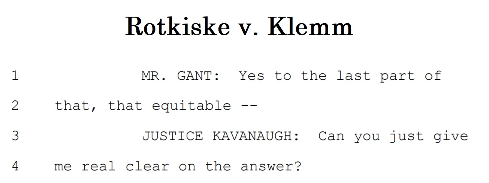
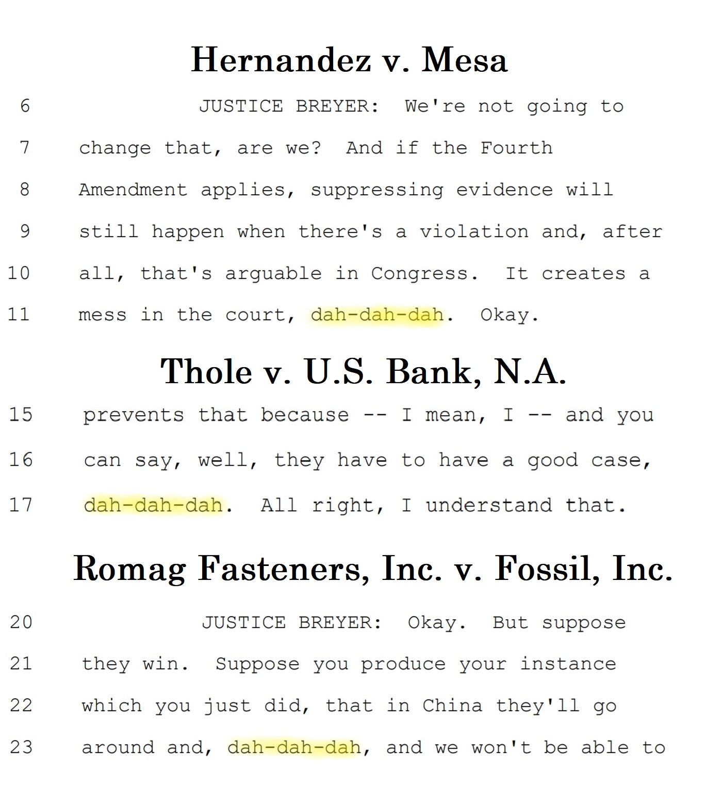

```{r setup, include=FALSE}
knitr::opts_chunk$set(echo = FALSE)
knitr::opts_chunk$set(warning = FALSE)
knitr::opts_chunk$set(message = FALSE)
```


# What is this project about?

The Supreme Court of the United States is one of the most powerful organs of American government. What makes it different from other institutions - and what makes it fascinating - is that the actions of this body depend entirely on the opinions of a handful of individuals who hold their jobs for decades and perform their duties in public. No other government department is so *consistently personal*. Anyone who wants to understand the court needs to understand the tendencies of its members.  

In this project, I study the transcripts of oral arguments before the court and attempt to gain some insight into the justices. To limit the scope of this project, I focus only on the **interactions between the justices and the petitioners**. (The petitioner is the party who requests that the court hear the case.) I also choose to focus only on **cases argued in the 2019 session**, and I exclude two cases where it is difficult to cleanly assign parties to the roles of petitioner and respondent (dockets [18-1323](https://www.supremecourt.gov/oral_arguments/argument_transcripts/2019/18-1323_d18e.pdf) and [18-1334](https://www.supremecourt.gov/oral_arguments/argument_transcripts/2019/18-1334_ba7d.pdf)).   

# How does it work?  

## Data Collection  

The project uses two data sources:  

* PDF transcripts of oral arguments, from the [Supreme Court's website](https://www.supremecourt.gov/oral_arguments/argument_transcript/2019)  
* a table of voting records and case details, from the [Supreme Court Database](http://scdb.wustl.edu/data.php) maintained by Washington University St. Louis  

First, data is collected from the PDFs and stored in a table. Then, I join the table of voting records based on justice names and docket numbers.  

At a high level, the PDF mining process works like this:  
1. Open one case PDF  
2. Extract the relevant section from the document - *oral argument of the petitioner*  
3. Extract the text for one justice who speaks in that section  
4. Analyze the extracted text for the justice (sentiment analysis + count of words, questions, interruptions)  
5. Create a single row of data for the analysis of the justice in this case  
6. Repeat for every justice in the case  
7. Repeat for every case PDF from 2019  

  

## Automated Text Analysis  

There are four components of text analysis which happen when building the table:  

* sentiment analysis
  + sentence-based sentiment analysis with the  **sentimentr** package  
  + unigram-based sentiment analysis with the **afinn** lexicon  
* count the number of **questions** the justice asked the petitioner  
* count the number of times the justice **interrupted** the petitioner  
* count the number of **words spoken** during Q&A with the petitioner  

Further manual analysis is done after building the table.  

### More on Sentiment Scores

For every case, I compute a **mean sentiment score** for the justices' speech with both methods. I chose these two methods because they both produce numerical scores, which allows us to compare the degree of positivity/negativity in different circumstances. The **sentimentr** method allows for calculating sentiment on a whole sentence, which has the potential to uncover critical differences in meaning due to negation of positive/negative terms (e.g. "That's *not* good news").     

Mean sentiment scores are calculated like this:  

* **sentimentr**: weighted mean of sentiment score for all sentences, with weights determined by the number of words in each sentence  
* **afinn**: remove stop words from text, take mean value of remaining words which have a sentiment score in the afinn lexicon  
  
### More on Detecting Interruptions  

It's possible to detect interruptions automatically because court stenographers have an extremely detailed and consistent way of recording everything vocalized during a trial. They don't just record words; they also record pauses, stutters, and abrupt stops committed by the speakers. In our text data, any one of these is represented by two dashes. We can detect interruptions as **lines that end with an abrupt stop, followed by text from another speaker**. Consider the example below:   

    
  
Mr. Gant's line ends with `--` and is followed by Justice Kavanaugh starting a new line. This is an interruption by Kavanaugh. After cleaning the text (removing line numbers, excess spaces, etc.) we can detect interruptions by Kavanaugh with a regular expression like this: `"-- JUSTICE KAVANAUGH"`.  
  
This process is straightforward thanks to the extremely standardized nature of the court reporting: abrupt stops are always represented with two dashes, names are written in all caps when there is a change of speaker, and speaker names are always written the same way within a document. We don't have to worry about accidentally counting a stutter as an interruption, because a stutter isn't followed by `JUSTICE NAME` in all caps in the dialogue.  
  
To handle this task automatically, I use a different regular expression generated for each justice.  
  


```{r load and process PDFs, echo = FALSE, warning = FALSE, message = FALSE}

###------------------------> NOTE: this chunk will take some time to run, go grab a coffee


#######################################################################
###################                                 ###################
###################                                 ###################
###################              SETUP              ###################
###################                                 ###################
###################                                 ###################
#######################################################################

# Set working directory to the directory which holds this script.
# setwd('your_working_directory_here')


####################
####################
##                ##
##    LIBRARIES   ##
##                ##
####################
####################


# libraries
library(tidyverse)
library(lubridate)
library(tm)
library(pdftools)
library(tidytext)
library(textdata)
library(data.table)
library(scales)
library(ggiraph)
library(ggpubr)
library(kableExtra)


####################
####################
##      SET       ##
##      FILE      ##
##      PATHS     ##
####################
####################


# file path for voting records
vote_records_csv_path <- 'data/raw/2019_vote_records/SCDB_2020_01_justiceCentered_Docket.csv'

# get file paths and names of all oral argument files in the data folder
pdf_filenames <- list.files(path = 'data/raw/2019_cases/', full.names = TRUE)


#######################################################################
###################                                 ###################
###################         READ AND SUMMARIZE      ###################
###################           ORAL ARGUMENT         ###################
###################            TRANSCRIPTS          ###################
###################                                 ###################
#######################################################################


####################
####################
##    FUNCTION    ##
##   TO PROCESS   ##
##  A SINGLE CASE ##
####################
####################


## -----> define constants outside the function


# all justices on the bench in the 2019 term
justices <- c("CHIEF JUSTICE ROBERTS",
              "JUSTICE THOMAS",
              "JUSTICE BREYER",
              "JUSTICE ALITO",
              "JUSTICE SOTOMAYOR",
              "JUSTICE KAGAN",
              "JUSTICE GORSUCH",
              "JUSTICE KAVANAUGH",
              "JUSTICE GINSBURG")

# custom stop words to withhold from some parts of the analysis
custom_stop_words <- data.frame(word = c('chief', 
                                         'justice',
                                         'roberts',
                                         'thomas',
                                         'breyer',
                                         'alito',
                                         'sotomayor',
                                         'kagan',
                                         'gorsuch',
                                         'kavanaugh',
                                         'ginsburg',
                                         'counsel',
                                         'argument',
                                         'ms'))

# expressions to filter out when counting questions - justices politely referring to each other ("Justice Kagan?" = it's your turn to speak, Justice Kagan)
justices_referring_to_each_other <- str_to_title(paste(justices, '\\?', sep = '', collapse = "|"))


## -----> define function for processing each PDF, and each justice in the text


# function takes one PDF file path and returns a dataframe with stats for the justices in that case
process_single_case <- function(filename){
  
  
  ## -----> load and parse document
  
  
  # extract the docket number from the filename
  docket <- str_extract(filename, "\\d+-\\d+")
  
  # reads each page into an element of the vector
  pdf_all_text <- pdf_text(filename)
  
  # grab date from text before cleaning
  date <- str_extract(pdf_all_text, 'Date:\\s+\\w+\\s\\d+,\\s\\d\\d\\d\\d')
  date <- date[!is.na(date)]
  date <- lubridate::parse_date_time(date, "b d Y")
  
  # steps to remove unwanted artifacts (line breaks and numbers) + boilerplate content on each page
  pdf_all_text <-
    pdf_all_text %>% 
    str_replace_all("Official\n\n\n", "") %>%  # cut boilerplate header/footer
    str_replace_all("\\n\\d+", '') %>% # cut line numbers (linebreaks before them)
    str_replace_all("\\d+\\n", "") %>%  # cut line numbers (linebreaks after them)
    str_replace_all("\\n", "") %>% # cut any linebreaks remaining
    str_replace_all("Official - Subject to Final Review", "") %>% # cut boilerplate header/footer
    str_replace_all("Heritage Reporting Corporation", "") %>% #cut boilerplate header/footer
    str_flatten(collapse = "") %>% # combine vector elements into one big text
    str_squish() # remove excess whitespace in the text
  
  # extract the part of the transcript which is the oral arguments of the petitioner(s)
  # lookbehind = start of argument for petitioners, lookahead = start of argument for respondent, capture all text in between
  # CAPITALIZATION MATTERS! these phrases mark the correct parts of the document only when capitalized
  oral_argument_of_petitioner <-
    str_extract(pdf_all_text, "(?<=ON BEHALF OF THE PETITIONER).*(?=ON BEHALF OF .* RESPONDENT)")
  
  
  ## -----> function to get stats for each justice who speaks in this document
  
  
  # this function takes a justice's name as an input, and returns a list containing summary stats for that justice
  single_judge_data <- function(selected_judge){
    
    # print current docket and justice to console so users can see the process running
    # print(paste0('Docket: ', docket, ' Judge: ', selected_judge)) ### NOT RUN FOR RMARKDOWN REPORT
    
    # pipeline for each judge wrapped in tryCatch to handle absent judges (example: abstention)
    tryCatch({  
      
      
      ## -----> define regex patterns for this justice
      
      
      # a pattern that indicates this justice is now speaking
      # example: "CHIEF JUSTICE ROBERTS: " "his words here" "CAPITAL LETTERS MARKING THE NEXT SPEAKER" appears whenever Roberts speaks
      # negative lookahead marks the end by identify a series of capital letters (the next speaker or document section is written in all caps)
      justice_is_speaking_pattern <- paste0(selected_judge,": .+?(?=\\s[A-Z][A-Z]+\\.?\\s)")
      
      # a pattern in the text which indicates that the justice has interrupted another speaker
      justice_is_interrupting_pattern <- paste0("-- ", selected_judge)
      
      
      ## -----> extract this justice's speech from the document
      
      
      # get all the text where the selected justice is speaking
      justice_speech <- str_extract_all(oral_argument_of_petitioner, justice_is_speaking_pattern, simplify = TRUE)
      
      # transform the text so - now each row represents one uninterrupted segment of spoken words from the justice
      justice_speech <-
        justice_speech %>% 
        as.data.frame() %>% 
        pivot_longer(everything()) %>% 
        select('value') %>% 
        rename('spoken_words' = 'value')
      
      
      ## -----> sentenced-based sentiment analysis with sentimentr
      
      
      # get sentences and compute sentiment score with sentimentr
      justice_sentences_with_sentimentr_scores <-
        justice_speech %>% 
        sentimentr::get_sentences() %>% 
        sentimentr::sentiment() %>% 
        mutate(spoken_words = str_remove_all(spoken_words, paste0(selected_judge, ": "))) # clean justice's name from text
      
      # store most positive sentence in a vector
      justice_most_positive_sentence <-
        justice_sentences_with_sentimentr_scores %>% 
        arrange(sentiment) %>% 
        slice_tail() %>% 
        pull(spoken_words)
      
      # store most negative sentence in a vector
      justice_most_negative_sentence <-
        justice_sentences_with_sentimentr_scores %>% 
        arrange(sentiment) %>% 
        slice_head() %>% 
        pull(spoken_words)
      
      # calculate mean sentiment of all sentences, weighted by word count of each sentence
      justice_mean_sentiment_sentimentr <- weighted.mean(justice_sentences_with_sentimentr_scores$sentiment, 
                                                         w = justice_sentences_with_sentimentr_scores$word_count)
      
      
      ## -----> token-based sentiment analysis with afinn lexicon
      
      
      # get all the words and count them
      justice_speech_tokens <-
        justice_speech %>% 
        unnest_tokens(word, spoken_words) %>% 
        anti_join(stop_words) %>% 
        anti_join(custom_stop_words) %>% 
        group_by(word) %>% 
        summarize(count = n()) %>% 
        arrange(desc(count))
      
      # get sentiments from 'afinn' because we want a numeric score so we can compare sentiments between justices, cases
      justice_sentiments_afinn <- 
        justice_speech_tokens %>% 
        inner_join(get_sentiments('afinn')) %>% 
        mutate(count_times_value = count * value)
      
      # get mean sentiment score of the justice's word
      justice_mean_sentiment_afinn <- 
        justice_sentiments_afinn %>% 
        summarize(mean = mean(count_times_value)) %>% 
        pull(mean)
      
      
      ## -----> other analysis on the justice's speech
      
      
      # count the number of time this justice interrupted another speaker
      justice_interruptions <- 
        str_extract_all(oral_argument_of_petitioner, justice_is_interrupting_pattern) %>% 
        unlist() %>% 
        length()
      
      # count the number of questions asked by this justice
      justice_questions <-
        justice_speech %>% 
        pull(spoken_words) %>% 
        str_flatten(collapse = "") %>% 
        str_remove_all(justices_referring_to_each_other) %>% # remove polite conversation between justices
        str_extract_all(pattern = "\\?") %>% 
        unlist() %>% 
        length()
      
      # count total words spoken (in this case, we'll also count stop words to get an accurate picture of how much they talked)
      justice_count_words_spoken <- 
        justice_speech %>% 
        unnest_tokens(word, spoken_words) %>% 
        pull(word) %>% 
        length()
      
      # top word spoken by the justice in this case
      justice_top_word <- 
        justice_speech_tokens %>% 
        head(1) %>% 
        pull(word)
      
      # store all the unigrams in a string so that we can put it in one cell in the dataframe
      justice_all_unigrams_as_a_string <-
        justice_speech %>% 
        unnest_tokens(word, spoken_words) %>% 
        anti_join(stop_words) %>% 
        anti_join(custom_stop_words) %>% 
        pull(word) %>% 
        str_flatten(collapse = " ")
      
      
      ## -----> store data in list
      
      
      # create a list of the information gathered
      summary_row <- list(docket_number = docket,
                          date_argued = date,
                          justice = selected_judge,
                          sentiment_score_afinn = justice_mean_sentiment_afinn,
                          sentiment_score_sentimentr = justice_mean_sentiment_sentimentr,
                          questions = justice_questions,
                          interruptions = justice_interruptions,
                          words_spoken = justice_count_words_spoken,
                          top_word = justice_top_word,
                          unigrams = justice_all_unigrams_as_a_string,
                          most_positive_sentence = justice_most_positive_sentence,
                          most_negative_sentence = justice_most_negative_sentence
                          )
      
    }, 
    
    # error condition for tryCatch - does nothing except allow the process to continue
    error = function(e){})
    
    # tryCatch on returning collected data - return a special NA list if there was an error
    tryCatch(return(summary_row), error = function(e){
      summary_row <- list(docket_number = docket,
                          date_argued = date,
                          justice = selected_judge,
                          sentiment_score_afinn = NA,
                          sentiment_score_sentimentr = NA,
                          questions = NA,
                          interruptions = NA,
                          words_spoken = NA,
                          top_word = NA,
                          unigrams = NA,
                          most_positive_sentence = NA,
                          most_negative_sentence = NA)
      
      return(summary_row)
      
    })
  }
  
  # get list of stats for each justice in the case, and bind lists to a dataframe
  single_case <- rbindlist(lapply(justices, single_judge_data))
  
  return(single_case)
}


####################
####################
##     PROCESS    ##
##       ALL      ##
##      CASES     ##
####################
####################


# for every file in pdf_filenames, call the process_single_case() function which returns a dataframe, then use rbindlist to bind rows for all dataframes
all_cases <- rbindlist(lapply(pdf_filenames, process_single_case))


####################
####################
##   READ & JOIN  ##
##  JUSTICE VOTE  ##
##     RECORDS    ##
####################
####################


# data.table's fread() handles the docket column correctly by default - read_csv() may have errors
vote_records <- fread(vote_records_csv_path)

# columns to keep for the vote records table
vote_records_columns_to_keep <- c('docket', 'justiceName', 'caseName', 'petitioner_wins', 'justice_in_majority', 'voted_for_petitioner')

# get TRUE/FALSE values for whether the petitioner won and whether the justice voted with the  majority or not
# then use boolean logic to determine if the justice voted in the petitioners favor or not
vote_records <-
  vote_records %>% 
  mutate(petitioner_wins = ifelse(partyWinning == 1, TRUE, FALSE)) %>% # if the petitioner "won" (val = 1) then TRUE, else (val = 0 (lose) or 2 (unclear)) FALSE
  mutate(justice_in_majority = ifelse(majority == 2, TRUE, FALSE)) %>% # if majority == 2, the justice voted with the majority, otherwise we consider it a dissent
  mutate(voted_for_petitioner = petitioner_wins & justice_in_majority) %>% # combinations of TRUE & FALSE tell us whether the judge voted for the petitioner or not
  select(all_of(vote_records_columns_to_keep))

# rename justices to match format from the other table
# since there are only 9 justices, it's easier just to do this manually
vote_records <-
  vote_records %>% 
  mutate(justiceName = ifelse(justiceName == "JGRoberts", "CHIEF JUSTICE ROBERTS", justiceName)) %>% 
  mutate(justiceName = ifelse(justiceName == "CThomas", "JUSTICE THOMAS", justiceName)) %>%
  mutate(justiceName = ifelse(justiceName == "SGBreyer", "JUSTICE BREYER", justiceName)) %>%
  mutate(justiceName = ifelse(justiceName == "SAAlito", "JUSTICE ALITO", justiceName)) %>%
  mutate(justiceName = ifelse(justiceName == "SSotomayor", "JUSTICE SOTOMAYOR", justiceName)) %>%
  mutate(justiceName = ifelse(justiceName == "EKagan", "JUSTICE KAGAN", justiceName)) %>%
  mutate(justiceName = ifelse(justiceName == "NMGorsuch", "JUSTICE GORSUCH", justiceName)) %>%
  mutate(justiceName = ifelse(justiceName == "BMKavanaugh", "JUSTICE KAVANAUGH", justiceName)) %>%
  mutate(justiceName = ifelse(justiceName == "RBGinsburg", "JUSTICE GINSBURG", justiceName))

# join vote records to the analysis table
all_cases_with_votes <-
  left_join(all_cases, vote_records, by = c("justice" = "justiceName", "docket_number" = "docket"))

# interesting NAs in docket 18-217: there were no votes, because the petition was dismissed with consent of both parties
# leave most NAs alone, but fill in the caseName variable so we can use it plot tooltips
all_cases_with_votes$caseName[all_cases_with_votes$docket_number == "18-217"] <- "MATHENA v. MALVO"


####################
####################
##      WRITE     ##
##   CLEAN TABLE  ##
##     TO CSV     ##
####################
####################


fwrite(all_cases_with_votes, file = 'data/clean/all_cases_with_votes.csv')

```  

# Findings

## Word Count  

### Word Count over Time

The chart below shows the number of words spoken by each justice (during the petitioners' arguments) in cases through the 2019 session. There aren't many interesting patterns here, except for Chief Justice Roberts suddenly getting a bit more talkative at the end of the session. Other than that, nothing to see --

### Wait a minute, what's up with Justice Thomas?  

Before we go any further into the analysis, I have to address one thing: this is not a mistake. There was no issue parsing the PDFs, there's nothing wrong with the data. Justice Clarence Thomas simply doesn't speak very often. In fact, [he once went 10 years without asking a question](https://www.nytimes.com/2016/03/01/us/politics/supreme-court-clarence-thomas.html). He broke that streak in 2016, but he still doesn't chime in much - [except during the pandemic](https://www.reuters.com/world/us/amid-pandemic-us-justice-clarence-thomas-has-question-or-two-2021-05-12/).   

Of the 56 arguments analyzed, Thomas spoke during 10 of them. I chose not to recode his NA values with 0s - I think the absence of dots on the graph makes the point better.  

```{r word count facet by justice, echo = FALSE, warning = FALSE, message = FALSE, fig.height = 10, fig.width = 10}

# words spoken by justices over time 
plot_words_spoken_over_time <-
all_cases_with_votes %>% 
  ggplot(aes(x = date_argued, y = words_spoken, color = justice)) +
  geom_smooth() + 
  geom_point_interactive(alpha = 0.5, aes(tooltip = paste0("Case: ", caseName,
                                                           "\n",
                                                           "Words spoken: ", words_spoken))) +
  labs(x = 'Date of Oral Argument', y = 'Spoken Word Count') +
  theme(legend.position = "none") +
  facet_wrap(~ justice)

# show plot
ggiraph(ggobj = plot_words_spoken_over_time)


```    

### Word Count by Vote Type  

Can we gauge which way a justice is leaning based on how much they talk to the petitioner? It depends on the justice.  

Most justices spoke more in cases where they eventually voted against the petitioner. Elena Kagan is the only exception. For Kavanaugh and Alito, the difference is quite pronounced. Alito can really go on a rant when he doesn't buy the petitioner's argument.  

```{r words by vote type, echo = FALSE, warning = FALSE, message = FALSE, fig.height = 10, fig.width = 10}

# words spoken by vote type
plot_words_spoken_by_vote_type <-
all_cases_with_votes %>% 
  drop_na(voted_for_petitioner) %>% 
  group_by(justice, voted_for_petitioner) %>% 
  summarize(mean_words_spoken = mean(words_spoken, na.rm = TRUE)) %>%
  rename(`Vote Type` = voted_for_petitioner) %>% 
  mutate(`Vote Type` = ifelse(`Vote Type` == TRUE, "For the Petitioner", "Against the Petitioner")) %>% 
  ggplot(aes(x = reorder(justice, -mean_words_spoken), y = mean_words_spoken)) +
  geom_line_interactive(size = 1.5, color = "grey30") +
  geom_point_interactive(aes(shape = `Vote Type`, fill = `Vote Type`, 
                             tooltip = paste0(round(mean_words_spoken, 0), " words on average")), 
                         size = 6) + 
  scale_shape_manual(values = c(25, 24)) +
  scale_fill_manual(values = c("orangered1", "dodgerblue4")) +
  labs(x = "", y = "Spoken Word Count") +
  coord_flip() +
  theme(legend.position = 'top')


# show plot
ggiraph(ggobj = plot_words_spoken_by_vote_type)

```  

## Questions  

Do they justices ask more questions in cases where they eventually vote against the petitioner?  
```{r mean questions t-test all justices, echo = FALSE, warning = FALSE, message = FALSE}
# p value of 0.01... yeah, they ask more questions when they vote against
questions_t_test <- t.test(questions ~ voted_for_petitioner, data = all_cases_with_votes)

# variables for markdown text
questions_mean_voted_for_petitioner <- round(questions_t_test$estimate[["mean in group TRUE"]], 2)
questions_mean_voted_against_petitioner <- round(questions_t_test$estimate[["mean in group FALSE"]], 2)
questions_p_value <- round(questions_t_test$p.value, 2)

```

Yes, according to a quick t-test in R: the estimated average number of questions from a justice who votes **FOR** the petitioner is `r questions_mean_voted_for_petitioner` compared to `r questions_mean_voted_against_petitioner` from a justice who votes **AGAINST**, with a p-value of `r questions_p_value`. But that's if we consider all justices together. Take a look at the individual justices below:  

```{r questions boxplot, echo = FALSE, warning = FALSE, message = FALSE, fig.height = 10, fig.width = 10}

# box plot of number of questions asked, conditioned on vote type
plot_questions_asked_by_vote_type <-
all_cases_with_votes %>% 
  drop_na(voted_for_petitioner) %>% 
  mutate(voted_for_petitioner = factor(voted_for_petitioner, levels = c("TRUE", "FALSE"))) %>% 
  ggplot(aes(x = voted_for_petitioner, y = questions, fill = justice)) +
  geom_boxplot(outlier.shape = NA, alpha = 0.5) +
  geom_jitter_interactive(aes(color = justice,
                              tooltip = paste0("Case: ", caseName,
                                               "\n",
                                               "Questions: ", questions)), 
                          width = 0.2, alpha = 0.35) +
  theme(legend.position = "none") +
  labs(x = "Voted For Petitioner", y = "Number of Questions Asked") +
  facet_wrap(~ justice)

# show plot
ggiraph(ggobj = plot_questions_asked_by_vote_type)


```  

The difference is quite meaningful for Alito and Gorsuch, but more subtle for the other justices. Breyer and Sotomayor aren't tipping their hands based on how many questions they ask.  

If you take a look at the table below, you'll see that the average number of questions asked is significantly different only for Alito, Gorsuch, and Kavanaugh. This table was generated by running a t-test on each justice individually.  

```{r mean questions t-test for individual justices, echo = FALSE, warning = FALSE, message = FALSE}

# function takes a justice as an argument, and performs a t-test on the data filtered to that justice
# t-test: is the mean number of questions different depending on whether the justice voted for or against the petitioner
mean_questions_t_test <- function(one_judge){
  
  # filter data to the the judge we want to examine
  filtered_data <- all_cases_with_votes[justice == one_judge]
  
  # students t-test: any difference in means when voted_for_petitioner is TRUE vs FALSE?
  questions_t_test_result <- t.test(questions ~ voted_for_petitioner, data = filtered_data)
  
  # label test results as significant/insignificant based on p-value cutoff of 0.05
  significance <- ifelse(questions_t_test_result$p.value < 0.05, "Significant", "Not Significant")
  
  # store results in list
  one_judge_t_questions_t_test_result <- list(Justice = one_judge,
                                              `Voted for Petitioner` = round(questions_t_test_result$estimate[['mean in group TRUE']], 2),
                                              `Voted against Petitioner` = round(questions_t_test_result$estimate[['mean in group FALSE']], 2),
                                              `Statistical Significance` = significance,
                                              `P-Value` = round(questions_t_test_result$p.value, 3))
  
}

# do t-test for all justices
questions_table <- rbindlist(lapply(justices, mean_questions_t_test))

# arrange by p value to show relevant justices first
questions_table %>%
  arrange(`P-Value`) %>%
  kable(caption = "Table: Average Number of Questions by Vote Type") %>%
  kable_material(c("striped", "hover")) 


```  

## Interruptions  

Conventional knowledge might say "people who agree with you don't cut you off when you are speaking". Based on the plots below, this might not be entirely true of Supreme Court Justices. They are just opinionated folks who want to get their word in.  

Ginsburg and Sotomayor both had occasions where they committed high numbers of interruptions in cases where they sided *with* the petitioner.  

Gorsuch exhibits an obvious pattern of interrupting more often in cases where he disagrees with the petitioner, but for the other justices, the conditional means are too close to be worth t-testing.  

```{r boxplot interruptions conditioned by vote type, echo = FALSE, warning = FALSE, message = FALSE, fig.height = 10, fig.width = 10}

# boxplot of interruptions by vote type
plot_interruptions_by_vote <-
all_cases_with_votes %>% 
  drop_na(voted_for_petitioner) %>% 
  mutate(voted_for_petitioner = factor(voted_for_petitioner, levels = c("TRUE", "FALSE"))) %>% 
  ggplot(aes(x = voted_for_petitioner, y = interruptions, fill = justice)) +
  geom_boxplot(outlier.shape = NA, alpha = 0.5) +
  geom_jitter_interactive(aes(color = justice, 
                              tooltip = paste0("Case: ", caseName,
                                               "\n",
                                               "Interruptions by justice: ", interruptions)),
                          width = 0.2, alpha = 0.35) +
  theme(legend.position = "none") +
  labs(x = "Voted For Petitioner", y = "Number of Interruptions") +
  facet_wrap(~ justice)

# show interactive plot
ggiraph(ggobj = plot_interruptions_by_vote)

```
## Sentiment

### Different Methods, Different Scores

I calculated sentiment scores on complete sentences with the **sentimentr** package, and on unigrams (single words) with the **afinn** lexicon. I found that these two approaches resulted in significantly different interpretations of the justices' speech.  

The two methods have different numerical scales, but they share a common principal: zero is neutral, positive numbers are "positive" emotions, negative numbers are "negative" emotions. Now, take a look at the score distributions in our data:  

```{r afinn vs sentimentr comparison, echo = FALSE, warning = FALSE, message = FALSE, fig.align = 'center'}

#SHOW PLOTS SIDE BY SIDE TO ILLUSTRATE DIFFERENT MEANS (positive leaning VS negative leaning)

# afinn distribution density
plot_sentiment_density_afinn <-
all_cases_with_votes %>% 
  ggplot(aes(x = sentiment_score_afinn)) +
  geom_density(fill = "lightsteelblue3") +
  geom_vline(xintercept = 0, linetype = "dotted") +
  scale_x_continuous(limits = c(-10,10)) +
  labs(title = "afinn", x = "Score", y = "Density")

# sentimentr distribution density
plot_sentiment_density_sentimentr <-
all_cases_with_votes %>% 
  ggplot(aes(x = sentiment_score_sentimentr)) +
  geom_density(fill = "tomato2") +
  geom_vline(xintercept = 0, linetype = "dotted") +
  scale_x_continuous(limits = c(-1,1)) +
  labs(title = "sentimentr", x = "Score", y = "Density")

# show plots side-by-side
ggarrange(plot_sentiment_density_afinn, 
          plot_sentiment_density_sentimentr,
          ncol = 2,
          nrow = 1)


```  

The **afinn** scores lean *very slightly* negative, while the **sentimentr** scores are notably positive on average.  

These two methods are different enough that they're not even really correlated. I standardized their scores (by calculating z-scores) and plotted them against each other:  

```{r afinn vs sentimentr z-score scatter, echo = FALSE, warning = FALSE, message = FALSE}

# scatter of z-scores for afinn and sentimentr
# the scores are weakly correlated within 2 standard deviations of their respective means
# and very different at the extremes
plot_sentiment_z_scores <- 
all_cases_with_votes %>%
  drop_na(sentiment_score_afinn, sentiment_score_sentimentr) %>% 
  mutate(afinn_scaled = (sentiment_score_afinn - mean(sentiment_score_afinn)) / sd(sentiment_score_afinn),
         sentimentr_scaled = (sentiment_score_sentimentr - mean(sentiment_score_sentimentr)) / sd(sentiment_score_sentimentr)) %>% 
  ggplot(aes(x = afinn_scaled, y = sentimentr_scaled)) +
  geom_point_interactive(aes(tooltip = paste0("sentimentr z-score: ", round(sentimentr_scaled, 2),
                                              "\n",
                                              "afinn z-score: ", round(afinn_scaled, 2)))) +
  geom_smooth(color = "red") +
  labs(title = "Scaled afinn & sentimentr scores", x = "afinn z-score", y = "sentimentr z-score")

# show plot
ggiraph(ggobj = plot_sentiment_z_scores)


```  

Among the cases which have sentiment scores closer to the mean, there appears to be some mild positive correlation between the two scoring systems. But as you move towards the extreme cases - starting at even one standard deviation away from the mean on either axis - the relationship totally falls apart. The upper-left and lower-right quadrants provide us a few examples of texts where they couldn't even agree on the polarity, much less the intensity, of the sentiment. (Perhaps this is due to **sentimentr** recognizing negation, which isn't possible when analyzing unigrams...)  

I decided to proceed with the sentiment analysis using the **afinn** lexicon on unigrams. The **sentimentr** package is a great solution for other applications, but it seems to have an unusually positive bias *on this particular data*.  

### Sentiment Distribution by Justice  

Let's take a look at the overall sentiment distributions for the individual justices in the 2019 session. If you blur your eyes and take a few steps back from your monitor, these distributions look surprisingly normal-ish. No justice is skewed drastically to the left or right, though there are some apparent tails.   

Gorsuch has an interesting pair of peaks in his distribution, with a depression around the neutral zero line. More on that in the next section.  

Do you notice any pattern regarding which justices lean to the left of the neutral line?

```{r sentiment density by justice, echo = FALSE, warning = FALSE, message = FALSE, fig.align = 'center', fig.height = 8, fig.width = 10}

# sentiment distribution by justice, density
plot_sentiment_density_all_justices <-
all_cases_with_votes %>% 
  ggplot(aes(x = sentiment_score_afinn, fill = justice)) + 
  geom_density() +
  geom_vline(xintercept = 0, linetype = "dotted") +
  scale_x_continuous(limits = c(-10,10)) +
  facet_wrap(~ justice) +
  labs(x = "Mean Sentiment Score (afinn)", y = "Density") +
  theme(legend.position =  "none")

# show plot
plot_sentiment_density_all_justices

```  

According to my eyes, it's justices Breyer, Ginsburg, Kagan, and Sotomayor. But no need to trust my eyes, consider the table below:  

```{r mean sentiment table, echo = FALSE, warning = FALSE, message = FALSE}

# we can see some interesting patterns visually...
# the Breyer, Ginsburg, Kagan, and Sotomayor seem to lean a bit negative
# these are the liberal justices
# confirm the negativity with the table
sentiment_table <-
all_cases_with_votes %>% 
  group_by(justice) %>% 
  summarize(`Mean Sentiment Score` = mean(sentiment_score_afinn, na.rm = TRUE)) %>% 
  rename(Justice = justice) %>% 
  arrange(`Mean Sentiment Score`)

sentiment_table %>% 
  kable(caption = "Table: Justices Ranked by Mean Sentiment Score") %>% 
  kable_material(c("striped", "hover"), full_width = F)

```  
Interesting. Breyer, Ginsburg, Kagan, and Sotomayor represent the liberal wing of the court. They sit at the top of this table for being the most negative, on average. The conservative justices, on the other, are lumped together at the bottom of this table. (If the pattern were perfect, Alito and Roberts would switch places, though.)  
  
Why might this be? It could be a result of the particular cases brought before the court this year. Donald Trump and Attorney General William Barr were party to [a](https://en.wikipedia.org/wiki/Trump_v._Mazars_USA,_LLP) [handful](https://en.wikipedia.org/wiki/Trump_v._Vance) [of](https://en.wikipedia.org/wiki/Barr_v._American_Assn._of_Political_Consultants,_Inc.) [cases](https://en.wikipedia.org/wiki/Barton_v._Barr) in this session. Or it could be that these four justices [have banded together and gotten defensive](https://www.npr.org/2020/07/15/891185410/in-supreme-court-term-liberals-stuck-together-while-conservatives-appeared-fract) in a court where conservatives outnumber them.  

### Sentiment Distribution by Justice, Conditioned by Vote Type

When we break down the distribution by vote type, we see a similar pattern as we did with the other metrics we studied: some justices exhibit obviously different patterns based on their opinion of the petitioner's argument, while others are a bit harder to read.  

```{r sentiment distribution by vote type, echo = FALSE, warning = FALSE, message = FALSE, fig.align = 'center', fig.height = 8, fig.width = 10}

# density conditioned on vote type
plot_sentiment_density_vote_type <-
all_cases_with_votes %>%
  drop_na(voted_for_petitioner) %>% 
  ggplot(aes(sentiment_score_afinn, fill = voted_for_petitioner)) +
  geom_density(alpha = 0.7) +
  labs(x = 'Mean Sentiment Score (afinn)', y = "Density") +
  geom_vline(xintercept = 0, linetype = "dotted") +
  scale_x_continuous(limits = c(-10,10)) +
  scale_fill_manual(name = "Vote Type", labels = c("Against the Petitioner", "For the Petitioner"), values = c("orangered1", "dodgerblue4")) +
  facet_wrap(~ justice) +
  theme(legend.position = "top")

# show plot
plot_sentiment_density_vote_type


```  

For Gorsuch, his conditional distributions are nearly mirrored images of each other: there is one distribution which describes his sentiment for arguments he agrees with, and flipped one for arguments he doesn't agree with. We can say the same for Sotomayor. For Sotomayor, we should also note that there is no overlap at the extreme ends of the spectrum. In her *most negative* cases, she always voted **against** the petitioner. In her *most positive* cases, she always voted **for** the petitioner.  

Ginsburg, Kagan, and Thomas have easy-to-read, incongruent distributions based on their eventual vote type.  

Alito and Breyer are a bit more even-handed, at least in this regard. Perhaps that's easy when you are always slightly grumpy.  

Chief Justice Roberts has a distribution that makes you look twice. Yes, the mean sentiment score is **positive** when voting **against** the petitioner, and **negative** when voting **for** the petitioner. (Remember, this analysis only analyzes the interaction between the justices and petitioners - the other side of the cases, the respondents, is excluded. So this seems very odd!)  

I will speculate about why his sentiment distribution seems out of line with his votes: 

Roberts has a tough job. He understands that he is often the "swing vote" in cases decided by this court. He knows that people see the Supreme Court as political, and [he doesn't like that](https://www.reuters.com/article/us-usa-court-chiefjustice-idUSKBN1WA08F). Additionally, as the chief justice, he has a certain duty to lead the court - and to lead courtroom discussions - in an unbiased way. For these reasons, I think we may not always see a candid display of his thoughts during oral arguments, but rather an attempt to appear neutral and handle both sides of the case fairly. If he already has an opinion during oral arguments, he may be trying to conceal it.  

## Vocabulary Analysis  

### Ginsburg & Gorsuch: Top Words by Vote Type {#gorsuchbackref}

I wanted to see if there were any interesting differences in the vocabularies of the justices. To start off, I simply counted the number of times that the justices said different words, and ranked them from most frequent to least frequent. This was not interesting; it turns out that all Supreme Justices say the words "person" and "law". So, I added a few more terms to my custom stop word list (*stop words* are words excluded from the analysis), and I decided to condition these word rankings on vote type.  

Take a look at that words used by Ginsburg and Gorsuch:  

```{r ginsburg and gorsuch top unigrams by vote type, echo = FALSE, warning = FALSE, message = FALSE, fig.align = 'center'}

## -----> a few more stop words 

# a few more stop words - these words were making visualizations less informative
ggplot_stop_word_list <- data.frame(word = c("person", "court", "law", "question", "read", "people"))

## -----> sort of a roll your own tf-idf solution....


# Ginsburg and Gorsuch, top unigrams by vote type, horizontal bars
plot_top_unigrams_by_vote_type_ginsburg_gorsuch <- 
all_cases_with_votes %>% 
  filter(justice %in% c("JUSTICE GINSBURG", "JUSTICE GORSUCH")) %>% 
  drop_na(voted_for_petitioner, unigrams) %>% 
  group_by(justice, voted_for_petitioner) %>% 
  unnest_tokens(word, unigrams) %>% 
  anti_join(ggplot_stop_word_list) %>% 
  count(word) %>% 
  arrange(justice, voted_for_petitioner, -n) %>% 
  rename(count = n) %>% 
  slice_max(n = 5, order_by = count) %>% ### NUMBER of words per group here
  mutate(directional_count = ifelse(voted_for_petitioner == TRUE, count, count * -1)) %>%
  ggplot(aes(x = reorder(word, directional_count), y = directional_count)) +
  geom_col(aes(fill = voted_for_petitioner)) +
  geom_label(aes(label = word)) +
  labs(title = "Top Words by Vote Type", x = "", y = "Number of Times Word Spoken") +
  scale_x_discrete(labels = NULL, breaks = NULL) +
  scale_y_continuous(breaks = c(-20, -10, 0, 10, 20), limits = c(-20, 20), labels = c("20", "10", "0", "10", "20")) +
  theme(legend.position = "top",
        plot.title = element_text(hjust = 0.5)) +
  scale_fill_manual(name = "", labels = c("Voted Against the Petitioner", "Voted For the Petitioner"), values = c("orangered1", "dodgerblue4")) +
  coord_flip() +
  facet_wrap(~ justice, scales = "free")

# show plot
plot_top_unigrams_by_vote_type_ginsburg_gorsuch

```  
  
These charts provide a little insight about what is important to the justices. Looking at the blue bars for Ginsburg, we can see that she talks about gender and equality - no surprise given her outstanding achievements in this domain. For Gorsuch, we spot some bedrock conservative themes: religion, speech, and the constitution ("amendment"). 

We also notice that one of the top words spoken by Gorsuch in cases where he voted for the petitioner is "yeah". This isn't an ideological insight, but it's an interesting pattern for anyone who wants to predict how he will vote.  

Among the orange bars, we see an interesting point of commonality between two very different jurists: words about the government, the courts, and the legal process.  

### TF-IDF for all Justices  

Term frequency-inverse document frequency (TF-IDF) is a measure of how important one word is *to a single document* after considering the presence of that word *across a whole collection of documents*. A word that is *rare in general* but appears *frequently in one document and not others* will have a high TF-IDF; a word that is *common* and appears *frequently in the whole collection of documents* will have a low TF-IDF. In this way, TF-IDF helps us identify the **distinguishing words** associated with a document.  

Below, we treat each justice's speech across the whole 2019 session as a separate document. (For example: all the words Roberts said during oral arguments this year is treated as one big document, all the words Thomas said is a separate document, all the words that Sotomayor said is another document, etc.)  

What words distinguish the justices from one another?  

```{r tf-idf for all justices, echo = FALSE, warning = FALSE, message = FALSE, fig.align = 'center', fig.width = 10, fig.height = 8}

## -----> tf-idf done the right way

# tf-idf for all justices # not conditioned on vote type
# explains each justices unique vocabulary
plot_tf_idf_all_justices <-
all_cases_with_votes %>% 
  drop_na(unigrams) %>% 
  unnest_tokens(word, unigrams) %>% 
  count(justice, word, sort = TRUE) %>% 
  bind_tf_idf(word, justice, n) %>% 
  group_by(justice) %>% 
  slice_max(tf_idf, n = 7) %>% 
  ungroup() %>% 
  mutate(word = reorder(word, tf_idf)) %>%
  ggplot(aes(tf_idf, word, fill = justice)) +
  geom_col(show.legend = FALSE) +
  labs(x = "TF-IDF: Distintive Vocabulary Among the Justices", y = NULL) +
  facet_wrap(~justice, ncol = 3, scales = "free")

# show plot
plot_tf_idf_all_justices

## talk about "Dah", show "dah" screenshots
```  

Here, we only gain less insight about the justices' beliefs, and we learn more about their mannerisms. Justice Robert's speech is distinguished by the word "briefly"; probably because he is directing the trial ("Briefly, counsel."). Justice Sotomayor says "concealing" a lot more than other justices; perhaps she thinks that the lawyers are hiding the true nature of their arguments. Justice Breyer is unique in saying... "dah"?  

Not a text-parsing error. Here are some snippets of Breyer using the term "dah-dah-dah":  
  
  
  
  
  
We can see why this word scored such a high TF-IDF: it is *highly* unique to Justice Breyer. If you gave me an unlabeled transcript of Supreme Court arguments and asked me to find a paragraph where Breyer was speaking, the first thing I would do is search for the term "dah".  

### TF-IDF for Roberts, Conditioned on Vote Type

If we focus on a single justice, and treat their speech prior to voting **for** and prior to voting **against** the petitioner as two separate documents, can we identify any terms that are unique to their speech based on how they will vote later?  

Let's try it on Chief Justice Roberts, who is often seen as the swing vote:  

```{r tf-idf roberts conditioned on vote type, echo = FALSE, warning = FALSE, message = FALSE, fig.align = 'center', fig.width = 12, fig.height = 9}

# high value for fig.width to avoid cutting image off in knitr render

# tf-idf for Roberts FOR vs AGAINST
# with special bar directions and absolute value scale
# explains unique language from roberts when based on how he feels about the petitioner's argument
plot_tf_idf_roberts_vote_type <-
all_cases_with_votes %>% 
  drop_na(unigrams) %>% 
  filter(justice == "CHIEF JUSTICE ROBERTS") %>% 
  mutate(voted_for_petitioner = ifelse(voted_for_petitioner == TRUE, "Voted For Petitioner", "Voted Against Petitioner")) %>% 
  unnest_tokens(word, unigrams) %>% 
  count(voted_for_petitioner, word, sort = TRUE) %>% 
  bind_tf_idf(word, voted_for_petitioner, n) %>% 
  group_by(voted_for_petitioner) %>% 
  slice_max(tf_idf, n = 5) %>% 
  ungroup() %>% 
  mutate(word = reorder(word, tf_idf)) %>%
  mutate(tf_idf = ifelse(voted_for_petitioner == "Voted For Petitioner", tf_idf, tf_idf * -1)) %>%  #flip direction of bars for "voted against"
  ggplot(aes(tf_idf, word)) +
  geom_col(aes(fill = voted_for_petitioner), show.legend = FALSE) +
  geom_label(aes(label = word)) +
  scale_fill_manual(values = c("orangered1", "dodgerblue4")) +
  scale_y_discrete(labels = NULL, breaks = NULL) +
  labs(x = "TF-IDF of Chief Justice Roberts", y = NULL) +
  facet_wrap(~ voted_for_petitioner, ncol = 2, scales = "free") +
  scale_x_continuous(labels = abs) # must be the last line

# show plot
plot_tf_idf_roberts_vote_type


```  

We have a mix of signal and noise. Some of these terms are informative, but some of them are likely particular to the cases which came before the court in this session (such as "groundwater").  

Words like "claim" and "theory" are often used when distancing one's self from another party's beliefs. "Frivolous" is not a word you want to hear come out of a judge's mouth during your oral arguments. We can see why these unigrams distinguish the **voted against** text from the **voted for** text.  

Among the blue columns, I would like to draw your attention to the word "yeah". This is something we saw [previously with Gorsuch](#gorsuchbackref): a mannerism of saying "yeah" during trials when he agrees with the petitioner's argument.  

# Wrap Up  

So, what's it good for?  

This project is about studying the speaking habits of the justices during oral arguments. It could be the starting point for building a predictive model for case outcomes ([as others have done](https://fivethirtyeight.com/features/how-to-read-the-mind-of-a-supreme-court-justice/)), but the primary purpose is to gain a deeper understanding of the human beings on the court.  

Here is a short, non-exhaustive, non-scientific recap of things we learned about the justices:  

**CHIEF JUSTICE ROBERTS**  

* sentiment behind his words might not match his real beliefs  
* often instructs lawyers to argue their points "briefly"  
* says "claim" and "theory" when he disagrees with your argument, "yeah" when he buys it  

**JUSTICE THOMAS**  

* doesn't talk much  

**JUSTICE BREYER**  

* talks a lot  
* says "dah-dah-dah" in the middle of his hypothetical examples  

**JUSTICE ALITO**  

* talks a lot more when he disagrees with you  
* ask more questions when he disagrees with you  

**JUSTICE SOTOMAYOR**  

* might interrupt you a lot; doesn't mean she is against your argument  
* sentiment behind her words matches her beliefs pretty well, especially if the sentiment is extreme  

**JUSTICE KAGAN**  

* she's the only justice who talks *more* when she agrees with you  
* sentiment is negative on average, and extra negative when she disagrees with you  

**JUSTICE GORSUCH**  

* asks more questions when he disagrees with you  
* interrupts more when he disagrees with you  
* says "yeah" when he agrees with you, talks about the government and courts when he doesn't  

**JUSTICE KAVANAUGH**  

* quiet when he agrees with you, moderately prolix when he doesn't  
* asks more questions when he disagrees with you  

**JUSTICE GINSBURG**  

* commonly negative in sentiment, and even more so when she disagrees with you  
* interested in topics concerning equality  
* talks about government and courts when she doesn't agree with you  